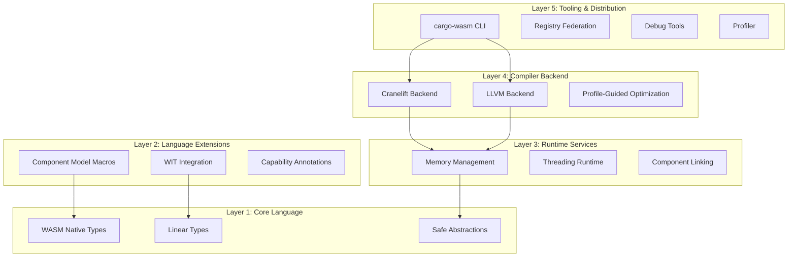
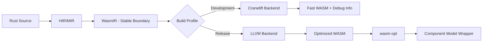

# WasmRust — Rust-to-WebAssembly Compiler

## Overview

**WasmRust** is a specialised Rust-to-WebAssembly compilation system designed to address limitations in the standard Rust WASM toolchain. It provides a **five-layer architecture** enabling:

* Minimal binary sizes
* Fast compilation times
* Seamless Component Model integration
* Efficient JavaScript interop
* Full Rust memory safety guarantees

WasmRust is a Rust compiler extension and ecosystem optimized for WebAssembly while preserving **full compatibility with standard Rust and the crates.io ecosystem**.

The system leverages **Cranelift** for rapid development builds, **LLVM** for optimized release builds, and introduces **WASM-native type abstractions** that eliminate impedance mismatches between Rust's ownership model and WebAssembly's execution environment.


WasmRust combines:

* Alternative **codegen backends** (Cranelift for fast dev, LLVM for optimized release)
* A **zero-cost core library** (`crates/wasm`)
* Optional **compiler extensions** for WASM-specific semantics
* First-class alignment with the **WebAssembly Component Model**

> **Key principle**:
> **WasmRust = rustc + WASM specialization**, not a new language.

---

## Repository Structure

```
wasmrust/
├── compiler/                # rustc extensions & backends
│   ├── codegen-cranelift/   # WASM-tuned Cranelift backend
│   └── codegen-llvm/        # WASM-optimized LLVM backend
│
├── crates/
│   ├── wasm/                # Core zero-cost WASM abstractions
│   └── wasm-macros/         # Proc macros (Component Model, WIT) [planned]
│
├── tooling/
│   └── cargo-wasm/          # WASM-aware Cargo frontend [planned]
│
├── docs/
│   ├── RFCs/
│   └── architecture/
│
└── ReadMe.md
```

This ReadMe describes the **WasmRust project as a whole**.
The `crates/wasm` directory has its own ReadMe focused strictly on the crate library.


---

## What Is WasmRust?

WasmRust is a **specialized Rust toolchain** that:

* Keeps the **Rust frontend unchanged** (parser, borrow checker, MIR)
* Swaps or augments **code generation** for WASM
* Provides **library-level primitives** that map directly to WASM concepts
* Enables **opt-in WASM features** without fragmenting Rust

```
┌─────────────────────────────────────────────┐
│                 rustc frontend              │
│   (parsing, HIR, MIR, borrow checking)       │
│                 UNCHANGED                   │
└───────────────────┬─────────────────────────┘
                    ▼
┌─────────────────────────────────────────────┐
│           WASM-specialized codegen           │
│   ┌────────────────┬────────────────────┐   │
│   │ Cranelift WASM │ LLVM WASM           │   │
│   │ (dev builds)   │ (release builds)    │   │
│   └────────────────┴────────────────────┘   │
└─────────────────────────────────────────────┘
                    ▼
┌─────────────────────────────────────────────┐
│         crates/wasm (zero-cost APIs)         │
│   externref, threads, components, memory    │
└─────────────────────────────────────────────┘
```

---

## crates/wasm (Core Library)

The `wasm` crate is the **foundation layer** of WasmRust.

It is intentionally:

* `no_std` by default
* Dependency-free
* Runtime-free
* Compiler-agnostic (works on stable rustc)

It provides **zero-cost abstractions** over WASM primitives that the WasmRust compiler can later recognize and optimize more aggressively.

### Crate Metadata

```toml
[package]
name = "wasm"
version = "0.1.0"
edition = "2021"
license = "MIT OR Apache-2.0"
description = "Zero-cost WebAssembly abstractions for Rust"
```

Located at: `crates/wasm`

---

## Why a Separate `wasm` Crate?

Because **most WASM semantics belong at the library boundary**, not inside the language.

The crate:

* Models **WASM concepts explicitly** (`externref`, shared memory, components)
* Allows **stable Rust users** to adopt WASM-first APIs today
* Gives the compiler a **semantic hook** for future optimizations
* Avoids polluting `std` with WASM-specific behavior

> This mirrors how `core`, `alloc`, and `std` evolved—layers, not forks.

---

## Compiler Extension Goals

WasmRust extends Rust at **codegen and optimization boundaries**, not syntax.

### Codegen Backends

* **Cranelift (development)**

  * 5–10× faster compilation
  * Optimized for iteration speed
  * Ideal for CI and inner dev loops

* **LLVM (release)**

  * Aggressive size and performance optimization
  * WASM-specific passes
  * Component Model metadata emission

Both backends target **identical Rust source code**.

---

## Opt-In WASM Features

WasmRust does **not** change Rust defaults.

Advanced features are opt-in via:

* Cargo features (`threads`, `component-model`, etc.)
* Compiler flags (`-Z wasm-*`, unstable)
* Explicit imports from `crates/wasm`

Examples:

* Structured WASM threading
* Linear resource handling
* Component Model ABI validation
* Thin monomorphization for size

---

## What Works Without WasmRust?

Everything in `crates/wasm`:

* Compiles on **stable Rust**
* Produces valid WASM today
* Has no dependency on a custom compiler

WasmRust **enhances**, but does not gate, functionality.

---

## What Requires the WasmRust Compiler?

* Native Component Model emission
* Cranelift-accelerated dev builds
* WASM-aware thin monomorphization
* Compiler-verified ABI/layout guarantees
* PGO tuned specifically for WASM

These are intentionally **not** possible from a library alone.

---

## Non-Goals

WasmRust is **not**:

* A Rust fork
* A new language
* A replacement for `wasm-bindgen` (initially)
* A JavaScript framework
* A runtime

It focuses strictly on **compilation correctness, size, and iteration speed**.

---

## Architecture

WasmRust follows a layered architecture separating concerns while enabling tight integration:



### Language Surface Contract

WasmRust is a **rustc extension, not a fork**, with the following composition:

* **Core (80%)**: Standard Rust compiler with custom codegen backend
* **Extensions (15%)**: `wasm` crate + proc macros for WASM-specific features
* **Compiler Plugins (4%)**: `-Z` unstable flags for advanced optimizations
* **Hard Fork (<1%)**: Minimal incompatible changes only if necessary

**Compatibility Guarantee**: Standard Rust code compiles unchanged. WASM-specific features are opt-in via the `wasm` crate.

**Migration Path**: Six-month deprecation window with automatic migration tools if upstream Rust introduces conflicting features.

---

### Host Profile Support

| Host Profile | Threading                     | JS Interop      | Component Model | Memory Regions |
| ------------ | ----------------------------- | --------------- | --------------- | -------------- |
| **Browser**  | SharedArrayBuffer + COOP/COEP | Direct calls    | Partial         | No             |
| **Node.js**  | Worker threads                | Native bindings | Polyfill        | No             |
| **Wasmtime** | wasi-threads                  | Host functions  | Full            | Configurable   |
| **Embedded** | No                            | No              | Partial         | No             |

> Performance guarantees apply only to supported host profiles.

---

## Compilation Pipeline



**WasmIR** is a stable intermediate representation between frontend and backends, encoding:

* Linear memory operations with bounds checking
* Reference types (`externref`, `funcref`) with lifetime tracking
* Component Model calling conventions
* Capability annotations for optimization
* Ownership and linearity invariants

---

## Core Features

### WASM Native Types

```rust
#[repr(transparent)]
pub struct ExternRef<T> { handle: u32, _marker: PhantomData<T> }
#[repr(transparent)]
pub struct FuncRef { handle: u32 }
pub struct SharedSlice<'a, T: wasm::Pod> { ptr: *const T, len: usize, _marker: PhantomData<&'a [T]> }
```

### Linear Types

```rust
#[wasm::linear]
struct CanvasContext(wasm::Handle);
```

### Language Extensions

* **Component Model Integration** via `#[wasm::component]` and WIT bindings
* **Capability Annotations** for thread, JS interop, and memory optimization

### Runtime Services

* **Memory Management**: Scoped arenas, host-validated memory regions
* **Threading Runtime**: Structured concurrency with automatic cleanup

### Compiler Backend

* **Dual Backend**: Cranelift (dev) / LLVM (release)
* **Profile-Guided Optimization** for hot paths, code layout, and branch prediction

---

## Testing and Verification

* **Property-Based Testing** for binary size, thin monomorphization, ownership enforcement, and threading safety
* **Cross-Language ABI Testing** for Zig, C, and other WASM components
* **Reproducible Builds** with deterministic profiles
* **Performance Benchmarks** for JS interop and threading

---

## Governance & Direction

* Designed to be upstream-friendly
* Successful ideas are candidates for Rust RFCs
* Library APIs stabilize first, compiler features later
* Avoids ecosystem fragmentation by design

---

## Where to Start

* 📦 Use `crates/wasm` today for low-level WASM code
* 📖 Read `docs/RFCs/0001-wasmrust-architecture.md`
* 🧪 Experiment with Cranelift WASM builds (nightly)
* 🛠️ Contribute to core abstractions before compiler work

---
