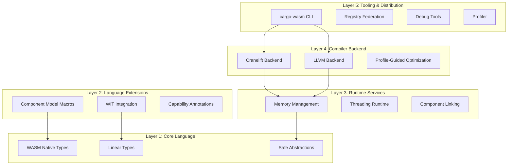
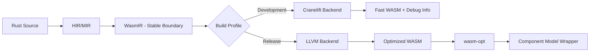

# WasmRust — Rust-to-WebAssembly Compiler

## Overview

**WasmRust** is a specialised Rust-to-WebAssembly compilation system designed to address limitations in the standard Rust WASM toolchain. It provides a **five-layer architecture** enabling:

* Minimal binary sizes
* Fast compilation times
* Seamless Component Model integration
* Efficient JavaScript interop
* Full Rust memory safety guarantees

The system leverages **Cranelift** for rapid development builds, **LLVM** for optimized release builds, and introduces **WASM-native type abstractions** that eliminate impedance mismatches between Rust's ownership model and WebAssembly's execution environment.

---

## Architecture

WasmRust follows a layered architecture separating concerns while enabling tight integration:



### Language Surface Contract

WasmRust is a **rustc extension, not a fork**, with the following composition:

* **Core (80%)**: Standard Rust compiler with custom codegen backend
* **Extensions (15%)**: `wasm` crate + proc macros for WASM-specific features
* **Compiler Plugins (4%)**: `-Z` unstable flags for advanced optimizations
* **Hard Fork (<1%)**: Minimal incompatible changes only if necessary

**Compatibility Guarantee**: Standard Rust code compiles unchanged. WASM-specific features are opt-in via the `wasm` crate.

**Migration Path**: Six-month deprecation window with automatic migration tools if upstream Rust introduces conflicting features.

---

### Host Profile Support

| Host Profile | Threading                     | JS Interop      | Component Model | Memory Regions |
| ------------ | ----------------------------- | --------------- | --------------- | -------------- |
| **Browser**  | SharedArrayBuffer + COOP/COEP | Direct calls    | Partial         | No             |
| **Node.js**  | Worker threads                | Native bindings | Polyfill        | No             |
| **Wasmtime** | wasi-threads                  | Host functions  | Full            | Configurable   |
| **Embedded** | No                            | No              | Partial         | No             |

> Performance guarantees apply only to supported host profiles.

---

## Compilation Pipeline



**WasmIR** is a stable intermediate representation between frontend and backends, encoding:

* Linear memory operations with bounds checking
* Reference types (`externref`, `funcref`) with lifetime tracking
* Component Model calling conventions
* Capability annotations for optimization
* Ownership and linearity invariants

---

## Core Features

### WASM Native Types

```rust
#[repr(transparent)]
pub struct ExternRef<T> { handle: u32, _marker: PhantomData<T> }
#[repr(transparent)]
pub struct FuncRef { handle: u32 }
pub struct SharedSlice<'a, T: wasm::Pod> { ptr: *const T, len: usize, _marker: PhantomData<&'a [T]> }
```

### Linear Types

```rust
#[wasm::linear]
struct CanvasContext(wasm::Handle);
```

### Language Extensions

* **Component Model Integration** via `#[wasm::component]` and WIT bindings
* **Capability Annotations** for thread, JS interop, and memory optimization

### Runtime Services

* **Memory Management**: Scoped arenas, host-validated memory regions
* **Threading Runtime**: Structured concurrency with automatic cleanup

### Compiler Backend

* **Dual Backend**: Cranelift (dev) / LLVM (release)
* **Profile-Guided Optimization** for hot paths, code layout, and branch prediction

---

## Testing and Verification

* **Property-Based Testing** for binary size, thin monomorphization, ownership enforcement, and threading safety
* **Cross-Language ABI Testing** for Zig, C, and other WASM components
* **Reproducible Builds** with deterministic profiles
* **Performance Benchmarks** for JS interop and threading

---

## Getting Started

```bash
# Build a WASM component
cargo wasm build --release --target wasm32-wasip2

# Publish to registry
cargo wasm publish --registry https://crates.wasm

# Run a component locally
cargo wasm serve --open
```

### Example

```rust
#[wasm::component(name = "image-filter", version = "1.0.0")]
mod filter {
    use wasm::{f32x4, externref, memory::View};

    #[wasm::import("gfx@2.1")]
    extern "wasm" { fn convolve_3x3(pixels: View<u8>, kernel: [f32; 9]) -> Vec<u8>; }

    #[wasm::export]
    pub fn sharpen(pixels: View<u8>, width: u32, height: u32) -> Vec<u8> {
        let kernel = [0.0, -1.0, 0.0, -1.0, 5.0, -1.0, 0.0, -1.0, 0.0];
        convolve_3x3(pixels, kernel)
    }
}
```
