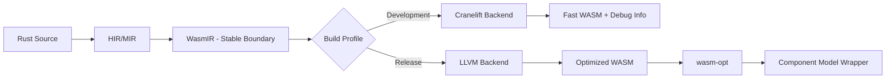

# WasmRust — Rust-to-WebAssembly Compiler

## Overview

**WasmRust** is a specialized Rust-to-WebAssembly compilation system designed to extend Rust’s capabilities for WebAssembly targets. It provides a **layered architecture** to enable:

*   Minimal binary sizes
*   Fast compilation times
*   Seamless WebAssembly Component Model integration
*   Efficient JavaScript interop
*   Full Rust memory safety guarantees

WasmRust is a **Rust compiler extension and ecosystem**, fully compatible with the standard Rust compiler and crates.io ecosystem.

It leverages:

*   **Cranelift** for rapid development builds
*   **LLVM** for optimized release builds
*   **WASM-native type abstractions** to eliminate impedance mismatches between Rust ownership and WebAssembly execution

> **Key principle:**
> **WasmRust = rustc + WASM specialization**, not a new language.

---

## Repository Structure

```
wasmrust/
├── compiler/                # rustc extensions & backends
│   ├── codegen-cranelift/   # WASM-tuned Cranelift backend
│   └── codegen-llvm/        # WASM-optimized LLVM backend
│
├── crates/
│   ├── wasm/                # Core zero-cost WASM abstractions
│   └── wasm-macros/         # Proc macros for Component Model / WIT [planned]
│
├── tooling/
│   └── cargo-wasm/          # WASM-aware Cargo frontend [planned]
│
├── docs/
│   ├── SAFETY.md            # Unsafe invariants per type / crate
│   ├── compiler-contract.md # Formal compiler ↔ crate contracts
│   ├── RFCs/
│   └── architecture/
│
└── ReadMe.md
```
> Each crate has its own README and normative safety documentation (`SAFETY.md`) describing unsafe invariants and compiler contracts.

---

## What Is WasmRust?

WasmRust is a **specialized Rust toolchain** that:

```text
┌─────────────────────────────────────────────┐
│                 rustc frontend              │
│   (parsing, HIR, MIR, borrow checking)       │
│                 UNCHANGED                   │
└───────────────────┬─────────────────────────┘
                    ▼
┌─────────────────────────────────────────────┐
│           WASM-specialized codegen           │
│   ┌────────────────┬────────────────────┐   │
│   │ Cranelift WASM │ LLVM WASM           │   │
│   │ (dev builds)   │ (release builds)    │   │
│   └────────────────┴────────────────────┘   │
└─────────────────────────────────────────────┘
                    ▼
┌─────────────────────────────────────────────┐
│         crates/wasm (zero-cost APIs)         │
│   externref, threads, components, memory    │
└─────────────────────────────────────────────┘
```

*   Keeps the **Rust frontend unchanged** (parser, HIR, MIR, borrow checker)
*   Swaps or augments **code generation** for WASM
*   Provides **library-level primitives** mapping directly to WASM concepts
*   Enables **opt-in WASM features** without fragmenting Rust

```text
rustc frontend (parser, HIR, MIR, borrow checking) → unchanged
           │
           ▼
WASM-specialized codegen
 ┌───────────────┬───────────────┐
 │ Cranelift WASM │ LLVM WASM    │
 │ (dev builds)   │ (release)    │
 └───────────────┴───────────────┘
           ▼
crates/wasm (zero-cost APIs: externref, threads, components, memory)
```

---

## crates/wasm (Core Library)

`wasm` is the **foundation layer** of WasmRust:

*   `no_std` by default
*   Dependency-free
*   Runtime-free
*   Compiler-agnostic (works on stable Rust)

It provides **zero-cost abstractions** over WASM primitives that the WasmRust compiler can recognize and optimize.

**Crate Metadata**:

```toml
[package]
name = "wasm"
version = "0.1.0"
edition = "2021"
license = "MIT OR Apache-2.0"
description = "Zero-cost WebAssembly abstractions for Rust"
```

**Location:** `crates/wasm`

---

### Why a Separate Crate?

*   Most WASM semantics belong at the **library boundary**, not inside the compiler
*   Models **WASM concepts explicitly** (`externref`, shared memory, components)
*   Allows **stable Rust users** to adopt WASM-first APIs today
*   Provides the compiler a **semantic hook** for optimizations
*   Mirrors how `core`, `alloc`, and `std` evolved—**layered abstractions**, not forks

---

## Compiler Extension Goals

WasmRust extends Rust at **codegen and optimization boundaries**, not syntax.

### Codegen Backends

*   **Cranelift (development)**
    *   5–10× faster compilation
    *   Optimized for iteration speed
    *   Ideal for CI and inner dev loops

*   **LLVM (release)**
    *   Aggressive size and performance optimization
    *   WASM-specific passes
    *   Component Model metadata emission

> Both backends target **identical Rust source code**.

---

## Opt-In WASM Features

Advanced features are **opt-in**, via:

*   Cargo features (`threads`, `component-model`)
*   Compiler flags (`-Z wasm-*`, unstable)
*   Explicit imports from `crates/wasm`

Examples:

*   Structured WASM threading
*   Linear resource handling
*   Component Model ABI validation
*   Thin monomorphization for minimal size

---

## What Works Without WasmRust?

Everything in `crates/wasm`:

*   Compiles on **stable Rust**
*   Produces valid WASM
*   Has no dependency on a custom compiler

> WasmRust **enhances**, but does not gate, functionality.

---

## What Requires the WasmRust Compiler?

*   Native Component Model emission
*   Cranelift-accelerated dev builds
*   WASM-aware thin monomorphization
*   Compiler-verified ABI/layout guarantees
*   PGO tuned specifically for WASM

> These cannot be achieved from a library alone.

---

## Non-Goals

WasmRust is **not**:

*   A Rust fork
*   A new language
*   A replacement for `wasm-bindgen` (initially)
*   A JavaScript framework
*   A runtime

Focus: **compilation correctness, size, and iteration speed**.

---

## Architecture

```mermaid
graph TB
    subgraph "Layer 5: Tooling & Distribution"
        A[cargo-wasm CLI [planned]]
        B[Registry Federation]
        C[Debug Tools]
        D[Profiler]
    end

    subgraph "Layer 4: Compiler Backend"
        E[Cranelift Backend]
        F[LLVM Backend]
        G[Profile-Guided Optimization]
        H[Verifier Pass [planned]]
        I[wasm-recognition Lints [planned]]
    end

    subgraph "Layer 3: Runtime Services"
        J[Memory Management]
        K[Threading Runtime]
        L[Component Linking]
    end

    subgraph "Layer 2: Language Extensions"
        M[Component Model Macros]
        N[WIT Integration]
        O[Capability Annotations]
    end

    subgraph "Layer 1: Core Language"
        P[WASM Native Types]
        Q[Linear Types]
        R[Safe Abstractions]
    end

    A --> E
    A --> F
    E --> J
    F --> J
    H --> E
    H --> F
    I --> H
    M --> P
    N --> Q
    J --> R
```

---

### Language Surface Contract

*   **Core (80%)**: Standard Rust compiler with custom codegen backend
*   **Extensions (15%)**: `wasm` crate + proc macros for WASM features
*   **Compiler Plugins (4%)**: `-Z` unstable flags for optimization
*   **Hard Fork (<1%)**: Minimal incompatible changes if required

> **Compatibility:** Standard Rust code compiles unchanged; WASM-specific features are opt-in.
> **Migration Path:** Six-month deprecation window with automatic migration tools if upstream Rust introduces conflicts.

---

### Host Profile Support

| Host Profile | Threading                     | JS Interop      | Component Model | Memory Regions |
| ------------ | ----------------------------- | --------------- | --------------- | -------------- |
| Browser      | SharedArrayBuffer + COOP/COEP | Direct calls    | Partial         | No             |
| Node.js      | Worker threads                | Native bindings | Polyfill        | No             |
| Wasmtime     | wasi-threads                  | Host functions  | Full            | Configurable   |
| Embedded     | No                            | No              | Partial         | No             |

> Performance guarantees apply only to supported profiles.

---

## Compilation Pipeline



**WasmIR** encodes:

*   Linear memory operations with bounds checking
*   Reference types (`externref`, `funcref`) with lifetime tracking
*   Component Model calling conventions
*   Capability annotations for optimization
*   Ownership and linearity invariants

---

## Core Features (with Contracts)

*   **WASM Native Types** (`ExternRef`, `FuncRef`)
    *   Compiler assumes valid lifetimes and opaque handles.
*   **Linear Types** (`#[wasm::linear]`)
    *   No implicit copies; moves enforce linearity.
*   **SharedSlice<T>**
    *   Only `Pod` types; bounds are statically verified.
*   **Component Model**
    *   ABI contracts enforced by compiler and verifier.

---
## Compiler ↔ Crate Contract

* The **compiler assumes** certain invariants when compiling code that uses `crates/wasm`:

  * `ExternRef<T>` and `FuncRef` are opaque handles with valid lifetime markers.
  * `SharedSlice<T>` contains only `Pod` types; aliasing and bounds are enforced.
  * Linear types (`#[wasm::linear]`) follow move semantics; the compiler assumes no implicit copies.
  * Component imports/exports use WIT-derived types; ABI must match exactly.
* Unsafe operations must maintain invariants documented in `SAFETY.md`.
* Compiler passes (e.g., verifier) will enforce these invariants at MIR and WasmIR level.
* Lints under `wasm-recognition` will detect misuses, such as:

  * `ExternRef` escaping a valid lifetime
  * Non-`Pod` types in `SharedSlice`
  * Invalid Component ABI usage

---

## Notes on SAFETY.md

* Contains **formal unsafe invariants** per type.
* Used by the compiler **verifier pass** and **lint group**.
* Serves as authoritative documentation for both crate users and compiler developers.

---

## Testing and Verification

*   Property-Based Testing: binary size, monomorphization, ownership enforcement, threading safety
*   Cross-Language ABI Testing: Zig, C, and other WASM components
*   Reproducible Builds: deterministic profiles
*   Performance Benchmarks: JS interop and threading

---

## Governance & Direction

*   Upstream-friendly design
*   Library APIs stabilize first, compiler features later
*   Avoids ecosystem fragmentation
*   RFC-driven feature evolution

---

## Where to Start

*   📦 Use `crates/wasm` for low-level WASM code today
*   📖 Read `docs/RFCs/0001-wasmrust-architecture.md`
*   🧪 Experiment with Cranelift WASM builds (nightly)
*   🛠️ Contribute to core abstractions before compiler work
