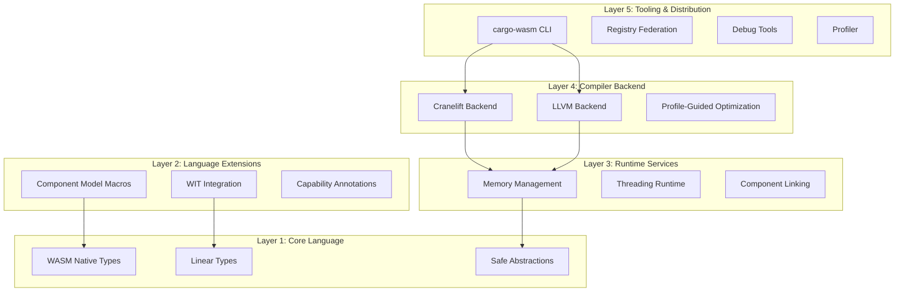
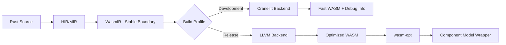

# WasmRust Compiler

## Overview

WasmRust is a specialized Rust-to-WebAssembly compilation system designed to address the current limitations of the standard Rust WASM toolchain. The system provides a five-layer architecture that delivers minimal binary sizes, fast compilation times, seamless Component Model integration, and efficient JavaScript interoperability while maintaining Rust's memory safety guarantees.

The design leverages Cranelift for fast development builds, LLVM for optimized release builds, and introduces WASM-native type abstractions that eliminate the impedance mismatch between Rust's ownership model and WebAssembly's execution environment.

## Architecture

The WasmRust system follows a layered architecture that separates concerns while enabling tight integration:



### Language Surface Contract

**WasmRust is a rustc extension, not a language fork** with the following implementation strategy:

- **Core (80%)**: Standard Rust compiler (rustc) with custom codegen backend
- **Extensions (15%)**: `wasm` crate + proc_macros for WASM-specific features  
- **Compiler Plugins (4%)**: `-Z` unstable flags for advanced optimizations
- **Hard Fork (<1%)**: Minimal incompatible changes only when absolutely necessary

**Compatibility Guarantee**: Standard Rust code compiles unchanged. WASM-specific features are opt-in via the `wasm` crate.

**Migration Path**: If upstream Rust adopts conflicting features, WasmRust provides 6-month deprecation window and automatic migration tools.

### Compiler-Crate Contract

**Fundamental Principle**: The `wasm` crate defines meaning. The compiler may accelerate meaning—but never redefine it.

The formal Compiler ↔ Crate Contract establishes:

1. **Zero-Cost Invariant**: All public types are `#[repr(transparent)]` or `#[repr(C)]`, layout-compatible with WASM, free of hidden allocations
2. **No Semantic Magic**: The `wasm` crate provides no behavior requiring compiler support
3. **Escape Hatch Rule**: Everything the compiler assumes must be reproducible by pure library implementation

**Verification**: The compiler implements the `wasm-recognition` lint group and `verify_wasm_invariants` MIR pass to mechanically verify all optimizations reference documented invariants and match only whitelisted MIR patterns.

### Host Profile Support

WasmRust supports different execution environments with varying capabilities:

| Host Profile | Threading | JS Interop | Component Model | Memory Regions |
|--------------|-----------|------------|-----------------|----------------|
| **Browser** | SharedArrayBuffer + COOP/COEP | Direct calls | Partial | No |
| **Node.js** | Worker threads | Native bindings | Via polyfill | No |
| **Wasmtime** | wasi-threads | Host functions | Full | Configurable |
| **Embedded** | No | No | Partial | No |

**Performance guarantees apply only within supported host profile capabilities.**

### Compilation Pipeline

The compilation process follows a dual-backend approach with explicit WasmIR boundary:



#### WasmIR: Stable Intermediate Representation

WasmIR serves as a stable boundary between frontend and backends, encoding:

- Linear memory operations with bounds checking
- Reference types (externref, funcref) with lifetime tracking  
- Component Model calling conventions
- Capability annotations for optimization
- Ownership and linearity invariants

#### Backend Contracts

**Cranelift Backend (Development Profile)**:
- **Guarantees**: Fast compilation, debuggable output, deterministic layout
- **Responsibilities**: Instruction selection, basic register allocation, simple inlining
- **Constraints**: No cross-module optimization, stable instruction ordering
- **Contract Compliance**: Only optimizes whitelisted MIR patterns from Compiler ↔ Crate Contract

**LLVM Backend (Release Profile)**:
- **Guarantees**: Maximum optimization, PGO support, minimal binary size
- **Responsibilities**: Aggressive optimization, whole-program analysis, size reduction
- **Constraints**: Longer compilation time acceptable
- **Contract Compliance**: All optimizations must reference documented invariants and pass verification

## Components and Interfaces

### Core Type System (Layer 1)

#### WASM Native Types

The foundation provides abstractions for WebAssembly reference types with explicit runtime contracts defined by the formal Compiler ↔ Crate Contract:

```rust
// ExternRef: Managed reference to JavaScript objects
// Contract: Maps 1:1 to WASM externref, opaque, non-dereferenceable
#[repr(transparent)]
pub struct ExternRef<T> {
    handle: u32, // Index into runtime reference table
    _marker: PhantomData<T>,
}

impl<T> ExternRef<T> {
    // Safety: handle must be valid in current reference table
    pub unsafe fn from_handle(handle: u32) -> Self { 
        Self { handle, _marker: PhantomData }
    }
    
    pub fn as_handle(&self) -> u32 { self.handle }
    
    // Method calls require host profile support
    pub fn call<Args, Ret>(&self, method: &str, args: Args) -> Result<Ret, InteropError>
    where T: js::HasMethod<Args, Ret> {
        // Compiler may optimize this to direct WASM externref calls
        unsafe { js::invoke_checked(self.handle, method, args) }
    }
}

// FuncRef: Managed function references
// Contract: Maps to WASM funcref, opaque handle
#[repr(transparent)]
pub struct FuncRef {
    handle: u32, // Index into function table
}

// SharedSlice: Safe shared memory access with explicit constraints
// Contract: T: Pod implies no pointers, no drop glue, bitwise movable
pub struct SharedSlice<'a, T: Pod> {
    ptr: NonNull<T>,
    len: usize,
    _marker: PhantomData<&'a [T]>,
}

// Pod trait: Types safe for zero-copy sharing
// Contract: Trivially copyable, no invalid bit patterns, no pointers
pub unsafe trait Pod: Copy + Send + Sync + 'static {
    // Marker trait for types with no internal pointers
}

unsafe impl Pod for u8 {}
unsafe impl Pod for i32 {}
unsafe impl Pod for f64 {}
// Complex types require explicit implementation with safety proof
```

**Compiler Contract Enforcement**: The compiler may only assume documented invariants and optimize whitelisted MIR patterns as specified in the formal contract.
```

#### Linear Types for Resource Management

Linear types enforce use-once semantics for WASM resources, preventing resource leaks:

```rust
#[wasm::linear]
struct CanvasContext(wasm::Handle);

impl CanvasContext {
    fn draw(&mut self) { /* ... */ }
    
    // Consuming method (moves ownership)
    fn into_bitmap(self) -> ImageData { /* ... */ }
}

// Compile error: can't use after move
let ctx = acquire_canvas();
let img = ctx.into_bitmap();
ctx.draw(); // ERROR: value moved
```

### Language Extensions (Layer 2)

#### Component Model Integration

WIT interfaces are treated as first-class citizens with bidirectional code generation:

```rust
// WIT definition embedded in Rust
#[wasm::wit]
interface crypto {
    use types.{bytes};
    
    resource key-pair {
        constructor(algorithm: string);
        sign: func(data: bytes) -> bytes;
    }
    
    hash-sha256: func(data: bytes) -> bytes;
}

// Generated Rust bindings
use crypto::{KeyPair, hash_sha256};

#[wasm::export]
fn sign_message(msg: &[u8]) -> Vec<u8> {
    let kp = KeyPair::new("ed25519");
    kp.sign(msg)
}
```

#### Capability Annotations (Not Effect System)

Instead of a full effect system, WasmRust uses capability annotations for optimization hints:

```rust
// Capability annotations for tree-shaking and optimization
#[wasm::capability(js_interop)]
fn fetch_data(url: &str) -> Result<Vec<u8>, Error> {
    // This function requires JS interop capability
    js::fetch(url)
}

#[wasm::capability(atomic_memory)]
fn update_counter(counter: &AtomicU32) {
    // This function requires atomic memory capability
    counter.fetch_add(1, Ordering::SeqCst);
}

// Pure functions (no capabilities required)
fn fibonacci(n: u32) -> u32 {
    // Can be tree-shaken if unused, inlined aggressively
    match n {
        0 | 1 => n,
        _ => fibonacci(n - 1) + fibonacci(n - 2),
    }
}
```

**Note**: This is not a type-level effect system but rather compile-time annotations for optimization and capability detection.

### Runtime Services (Layer 3)

#### Memory Management

Capability-annotated memory intents with host validation:

```rust
// Memory region annotations are intents, not guarantees
#[wasm::memory_intent(region = "eu-west-1", encryption = "AES256-GCM")]
static EU_DATA: wasm::Memory<8_000_000>; // 8 MB max

#[wasm::memory_intent(region = "cn-north-1")]
static CN_DATA: wasm::Memory<8_000_000>;

#[wasm::export]
fn process_gdpr_data(user_id: &str) -> Result<(), Error> {
    // Host validates region capability at load time
    let region = detect_region(user_id);
    match region {
        Region::EU => {
            // Fails at runtime if host doesn't support EU region
            EU_DATA.write(user_id, data)
                .map_err(|_| Error::RegionUnsupported)?
        },
        Region::CN => {
            CN_DATA.write(user_id, data)
                .map_err(|_| Error::RegionUnsupported)?
        },
        _ => return Err(Error::UnsupportedRegion),
    }
    Ok(())
}
```

**Host Profile Contract**: Memory region intents are validated by the host at component load time. Unsupported regions cause load-time failures, not runtime violations.

#### Threading Runtime

Structured concurrency with automatic cleanup and capability detection:

```rust
use wasm::thread::scope;

#[wasm::export]
fn parallel_transform(data: SharedSlice<f32>) -> Result<(), Error> {
    // Detect threading capability
    if !wasm::thread::available() {
        return sequential_transform(data);
    }
    
    scope(|s| {
        for chunk in data.chunks(1000) {
            s.spawn(|| process(chunk)); // Lifetime tied to scope
        }
        // All threads joined here automatically
    })?;
    Ok(())
}
```

### Compiler Backend (Layer 4)

#### Dual Backend Strategy

**Development Profile (Cranelift)**:
- Target: <5 seconds compilation for 10k LOC
- Optimizations: Basic register allocation, simple inlining
- Output: Functional but unoptimized WASM

**Release Profile (LLVM)**:
- Target: Maximum performance and size optimization
- Optimizations: Full LLVM optimization pipeline + wasm-opt
- Output: Production-ready WASM with PGO support

#### Profile-Guided Optimization

Three-phase optimization process:

```bash
# Phase 1: Build with instrumentation
cargo wasm build --profile=instrumented

# Phase 2: Collect profiles in production
wasm-runner ./app.wasm --collect-profile=prod.prof

# Phase 3: Rebuild with profile data
cargo wasm build --release --pgo=prod.prof
```

Data collected includes:
- Function call frequencies for inlining decisions
- Cold code paths for lazy loading
- Memory access patterns for data layout optimization
- Branch prediction data for control flow optimization

## Compiler-Crate Contract

### Contract Overview

The formal Compiler ↔ Crate Contract prevents unsound optimizations and ecosystem lock-in by establishing explicit boundaries between the WasmRust compiler and the `wasm` crate.

### Unsafe Invariants

#### Type-Level Invariants

**ExternRef<T>**:
- **Opaque Handle**: `handle` is never interpreted as a pointer to linear memory
- **Non-Aliasing**: Does not alias any Rust-accessible memory
- **Drop Transparency**: Dropping has no observable Rust side effects
- **Type Marker Only**: `T` is compile-time only, does not affect runtime behavior

**SharedSlice<'a, T: Pod>**:
- **Valid Memory Range**: Pointer + length remains valid for `'a`
- **Pod Soundness**: `T` satisfies all Pod invariants (no pointers, no drop, bitwise movable)
- **No Implicit Atomics**: Concurrent access requires explicit synchronization
- **Standard Slice Aliasing**: Rust aliasing rules apply without relaxation

**Pod Trait**:
- **Bit Validity**: Every possible bit pattern is valid
- **Move Transparency**: Bitwise move preserves meaning
- **No Hidden Semantics**: No drop glue, interior pointers, or provenance tracking

### MIR Pattern Matching

The compiler may only optimize these specific MIR patterns:

1. **ExternRef Pass-Through**: `_1 = ExternRef::new(_2); _3 = call foo(_1)`
   - Allowed: Treat as opaque scalar, lower to WASM externref, elide wrapper construction
   - Forbidden: Load/store folding, assuming purity, CSE across calls

2. **SharedSlice Load**: `_elt = (*(_slice.ptr + idx))` where `T: Pod`
   - Allowed: Direct WASM loads, vectorization, loop unrolling
   - Forbidden: Removing bounds checks unless proven, introducing atomics

3. **Pod Copy**: `_2 = _1` where `T: Pod`
   - Allowed: memcpy, register moves, SIMD copy
   - Forbidden: Assuming padding irrelevance across FFI

4. **Component Boundary Call**: `_0 = call component::import_X(_1, _2)`
   - Allowed: ABI lowering, validation insertion
   - Forbidden: Assuming shared memory, reordering across component calls

### Verification Infrastructure

**wasm-recognition Lint Group**:
- `wasm_unverified_invariant_use`: Optimization lacks invariant reference
- `wasm_illegal_mir_shape`: Transformation matches non-whitelisted pattern
- `wasm_backend_specific_assumption`: Assumes LLVM/Cranelift-specific behavior
- `wasm_unsafe_macro_semantics`: Assumes macro semantics beyond MIR

**verify_wasm_invariants MIR Pass**:
- Runs after borrow checking, before backend lowering
- Records invariant references and MIR patterns for each optimization
- Enforces backend neutrality and negative pattern detection
- Fails compilation with explicit diagnostics if violations found

### Optimization Safety Rules

**Allowed Optimizations**:
- Inline through wasm wrappers (if MIR pattern matches)
- Merge monomorphizations when proven safe
- Remove unused exports
- Replace library calls with intrinsics (with invariant reference)
- Reorder WASM sections

**Forbidden Optimizations**:
- Change observable behavior
- Introduce UB if wasm crate is replaced
- Assume unsafe blocks are safe
- Break Rust aliasing or lifetime rules
- Optimize based on undocumented layout

**Escape Hatch Rule**: If an optimization cannot be expressed as inlining, dead-code elimination, or layout preservation, it does not belong in the compiler.

## Data Models

### Component Interface Definition

Components are defined using WIT syntax with Rust type mappings:

```wit
// crypto.wit
package wasm-rust:crypto@1.0.0;

interface signing {
    use wasi:io/streams.{input-stream, output-stream};
    
    resource key-pair {
        constructor(algorithm: string);
        sign: func(data: list<u8>) -> result<list<u8>, error>;
        verify: func(data: list<u8>, signature: list<u8>) -> result<bool, error>;
    }
    
    hash-sha256: func(data: list<u8>) -> list<u8>;
}

world crypto-component {
    export signing;
    import wasi:io/streams@0.2.0;
}
```

### Memory Layout Optimization

The compiler optimizes data layout based on usage patterns:

```rust
// Before optimization
struct UserData {
    id: u64,        // 8 bytes
    name: String,   // 24 bytes (fat pointer)
    active: bool,   // 1 byte + 7 padding
    score: f32,     // 4 bytes + 4 padding
}

// After optimization (hot/cold splitting)
#[wasm::hot_data]
struct UserHotData {
    id: u64,        // Frequently accessed
    active: bool,   // Frequently accessed
    score: f32,     // Frequently accessed
}

#[wasm::cold_data]  
struct UserColdData {
    name: String,   // Infrequently accessed
}
```

## Correctness Properties

*A property is a characteristic or behavior that should hold true across all valid executions of a system—essentially, a formal statement about what the system should do. Properties serve as the bridge between human-readable specifications and machine-verifiable correctness guarantees.*

Based on the prework analysis, the following properties have been identified as testable through property-based testing:

### Property 1: Binary Size Scaling
*For any* application with standard library features, the WasmRust compiler output should be at most 3x larger than equivalent C programs compiled with similar feature sets
**Validates: Requirements 1.2**

### Property 2: Thin Monomorphization Effectiveness  
*For any* codebase using generic functions, applying thin monomorphization should reduce code duplication by at least 30% compared to current rustc output
**Validates: Requirements 1.3**

### Property 3: Cranelift Performance Advantage
*For any* codebase, compilation with Cranelift backend should be at least 5x faster than LLVM backend compilation
**Validates: Requirements 2.2**

### Property 4: Ownership Rule Enforcement
*For any* Rust program with ownership violations, the WasmRust compiler should reject the program at compile time with appropriate error messages
**Validates: Requirements 3.1**

### Property 5: Shared Memory Safety
*For any* attempt to create data races through SharedSlice usage, the type system should prevent compilation with clear error messages
**Validates: Requirements 3.2**

### Property 6: JavaScript Interop Performance
*For any* supported host profile, JavaScript function calls through WasmRust runtime should have boundary costs under 100 nanoseconds per call with zero-copy data transfer for Pod types
**Validates: Requirements 4.1, 4.2**

**Note**: Performance guarantees apply only to supported host profiles (browser, Node.js, Wasmtime). Sandboxed or security-wrapped environments may have higher overhead.

### Property 7: Component Model Compliance
*For any* WasmRust-generated WASM module, the output should validate successfully against Component Model specification tools
**Validates: Requirements 5.1**

### Property 8: WIT Round-trip Consistency
*For any* valid Rust interface definition, the round-trip transformation Rust → WIT → Rust should produce semantically equivalent code
**Validates: Requirements 5.2**

### Property 9: Structured Concurrency Cleanup
*For any* threaded execution using WasmRust runtime, all spawned threads should be automatically joined and cleaned up when the scope exits
**Validates: Requirements 6.1**

### Property 10: Threading Capability Adaptation
*For any* environment, the WasmRust runtime should correctly detect threading capability and provide appropriate execution model (threaded or single-threaded fallback)
**Validates: Requirements 6.4**

### Property 11: Multi-language Type Safety
*For any* Zig component import in supported host profiles, the WasmRust runtime should provide type-safe bindings that prevent ABI mismatches at compile time
**Validates: Requirements 8.1, 8.3**

### Property 12: Deterministic Instrumentation
*For any* source code, building with instrumentation should produce identical profiling hooks across multiple compilation runs
**Validates: Requirements 10.1**

### Property 14: Compiler Error Quality
*For any* Rust program with a type error, the WasmRust compiler should produce an error message that identifies the exact location, explains the type mismatch in plain language, suggests a fix when possible, and links to relevant documentation
**Validates: Requirements 12.3**

### Property 15: Cross-Language ABI Compatibility  
*For any* struct marked with `#[repr(C)]`, the memory layout produced by WasmRust should be identical to the layout produced by Clang with equivalent flags
**Validates: Requirements 8.3**

<function_calls>
<invoke name="prework">
<parameter name="featureName">wasm-rust-compiler

## Error Handling

### Compilation Errors

The WasmRust compiler provides structured error reporting with actionable suggestions:

```rust
// Example: Linear type violation
error[E0382]: borrow of moved value: `ctx`
  --> src/main.rs:15:5
   |
12 |     let ctx = acquire_canvas();
   |         --- move occurs because `ctx` has type `CanvasContext`, which implements linear semantics
13 |     let img = ctx.into_bitmap();
   |               --- value moved here due to consuming method
14 |     
15 |     ctx.draw();
   |     ^^^ value borrowed here after move
   |
   = note: linear types enforce use-once semantics for WASM resources
   = help: consider cloning the context before the consuming operation
   = help: see https://wasmrust.dev/book/linear-types for more information
```

### Runtime Error Recovery

The runtime provides graceful degradation for environment limitations:

```rust
// Threading capability detection with fallback
match wasm::thread::spawn_shared(|| compute_heavy_task()) {
    Ok(handle) => handle.join().unwrap(),
    Err(ThreadingUnavailable) => {
        log::warn!("Threading unavailable, using fallback");
        compute_heavy_task() // Single-threaded path
    }
}

// Component loading with graceful degradation
match wasm::component::load("crypto@1.0") {
    Ok(component) => component.hash_sha256(data),
    Err(ComponentNotFound) => {
        log::info!("Component unavailable, using built-in implementation");
        builtin_sha256(data) // Fallback implementation
    }
}

// Memory region intent validation
#[wasm::export]
fn process_gdpr_data(user_id: &str) -> Result<(), ProcessingError> {
    let region = detect_region(user_id);
    match region {
        Region::EU => {
            EU_DATA.write(user_id, data)
                .map_err(|_| ProcessingError::RegionUnsupported {
                    region: "eu-west-1",
                    message: "Host does not support EU data residency requirements"
                })?
        },
        _ => return Err(ProcessingError::UnsupportedRegion),
    }
    Ok(())
}
```

### Memory Safety Violations

All memory safety violations are caught at compile time through Rust's type system extended with WASM-specific constraints:

- **Dangling pointers**: Prevented by lifetime analysis
- **Buffer overflows**: Prevented by bounds checking in debug builds, eliminated in release builds through optimization
- **Use-after-free**: Prevented by ownership system
- **Data races**: Prevented by SharedSlice type constraints and Send/Sync bounds
- **Resource leaks**: Prevented by linear types for WASM resources (when enabled via `-Z wasm-linear-types`)

## Testing Strategy

### Dual Testing Approach

WasmRust employs both unit testing and property-based testing for comprehensive coverage:

**Unit Tests**:
- Specific examples demonstrating correct behavior
- Edge cases and boundary conditions  
- Integration points between components
- Error condition handling

**Property-Based Tests**:
- Universal properties holding across all inputs
- Comprehensive input coverage through randomization
- Minimum 100 iterations per property test
- Each test tagged with corresponding design property

### Property-Based Testing Configuration

Using **QuickCheck** for Rust, each property test follows this pattern:

```rust
#[quickcheck]
fn binary_size_scaling_property(app_features: Vec<Feature>) -> TestResult {
    // Feature: wasm-rust-compiler, Property 1: Binary Size Scaling
    
    if app_features.is_empty() {
        return TestResult::discard();
    }
    
    let rust_binary = compile_wasmrust(&app_features);
    let c_binary = compile_c_equivalent(&app_features);
    
    TestResult::from_bool(
        rust_binary.size() <= c_binary.size() * 3
    )
}

#[quickcheck] 
fn cranelift_performance_property(codebase: RandomCodebase) -> bool {
    // Feature: wasm-rust-compiler, Property 3: Cranelift Performance Advantage
    
    let cranelift_time = measure_compilation_time(&codebase, Backend::Cranelift);
    let llvm_time = measure_compilation_time(&codebase, Backend::LLVM);
    
    cranelift_time * 5 <= llvm_time
}
```

### Cross-Language ABI Testing

Multi-language component integration with explicit ABI validation:

```rust
#[test]
fn zig_rust_abi_compatibility() {
    // Zig component that returns a struct
    let zig_component = compile_zig_component(r#"
        const Point = struct { x: i32, y: i32 };
        export fn get_point() Point {
            return Point{ .x = 10, .y = 20 };
        }
    "#);
    
    // Rust code expecting same struct layout
    #[repr(C)]
    struct Point { x: i32, y: i32 }
    
    let point: Point = call_component_function(&zig_component, "get_point");
    
    assert_eq!(point.x, 10);
    assert_eq!(point.y, 20);
}

#[quickcheck]
fn struct_layout_stability(rust_struct: ArbitraryStruct) -> bool {
    // Feature: wasm-rust-compiler, Property 15: Cross-Language ABI Compatibility
    
    // Verify #[repr(C)] produces consistent layout across compilers
    let wasmrust_layout = compute_layout_wasmrust(&rust_struct);
    let clang_layout = compute_layout_clang(&rust_struct);
    
    wasmrust_layout == clang_layout
}
```

### Failure Mode Testing

Testing compiler error quality and recovery paths:

```rust
#[quickcheck]
fn compiler_error_quality(invalid_program: InvalidRustCode) -> TestResult {
    // Feature: wasm-rust-compiler, Property 14: Compiler Error Quality
    
    if invalid_program.is_trivially_valid() {
        return TestResult::discard();
    }
    
    let error = compile_wasmrust(&invalid_program).unwrap_err();
    
    TestResult::from_bool(
        error.has_precise_location() &&
        error.has_explanation() &&
        error.suggestions().len() > 0 &&
        error.has_documentation_link()
    )
}

#[test]
fn threading_fallback_behavior() {
    // Test graceful degradation when threading is unavailable
    let mock_env = MockEnvironment::new().without_threading();
    
    let result = mock_env.run_wasm_function(|| {
        wasm::thread::spawn_shared(|| 42)
    });
    
    // Should succeed with single-threaded fallback
    assert_eq!(result.unwrap(), 42);
    assert!(mock_env.warnings().contains("Threading unavailable, using fallback"));
}
```

### Performance Benchmarking

Continuous performance monitoring ensures regression detection:

```rust
#[bench]
fn js_interop_overhead(b: &mut Bencher) {
    let js_function = setup_js_function();
    let test_data = vec![0u8; 1024];
    
    b.iter(|| {
        let start = Instant::now();
        js_function.call(&test_data);
        let duration = start.elapsed();
        
        // Validate: under 100ns per call
        assert!(duration < Duration::from_nanos(100));
    });
}
```

### Reproducibility Testing

Build determinism is validated through hash comparison with version pinning:

```rust
#[test]
fn reproducible_builds() {
    let source = load_test_source("sample.rs");
    let toolchain_version = WasmRustVersion::current();
    
    let build1 = compile_with_profile(&source, &profile_data, &toolchain_version);
    let build2 = compile_with_profile(&source, &profile_data, &toolchain_version);
    
    assert_eq!(
        build1.content_hash(),
        build2.content_hash(),
        "Builds with identical inputs must be reproducible"
    );
    
    // Verify toolchain identity is embedded
    assert_eq!(build1.toolchain_hash(), toolchain_version.hash());
}

#[test]
fn profile_normalization() {
    let profile_data = load_profile_data("production.prof");
    let normalized1 = normalize_profile(&profile_data);
    let normalized2 = normalize_profile(&profile_data);
    
    assert_eq!(normalized1, normalized2, "Profile normalization must be deterministic");
}
```

### Performance Benchmarking

Continuous performance monitoring with host-profile-aware assertions:

```rust
#[bench]
fn js_interop_overhead(b: &mut Bencher) {
    let host_profile = detect_host_profile();
    let js_function = setup_js_function();
    let test_data = vec![0u8; 1024];
    
    b.iter(|| {
        let start = Instant::now();
        js_function.call(&test_data);
        let duration = start.elapsed();
        
        // Host-profile-gated performance assertions
        match host_profile {
            HostProfile::Browser => {
                assert!(duration < Duration::from_nanos(100));
            },
            HostProfile::NodeJs => {
                assert!(duration < Duration::from_nanos(50));
            },
            HostProfile::Wasmtime => {
                assert!(duration < Duration::from_nanos(25));
            },
            _ => {
                // No performance guarantees for other profiles
            }
        }
    });
}

This comprehensive testing strategy ensures that WasmRust delivers on its performance, safety, and compatibility promises while maintaining the reliability expected from production compiler toolchains.
